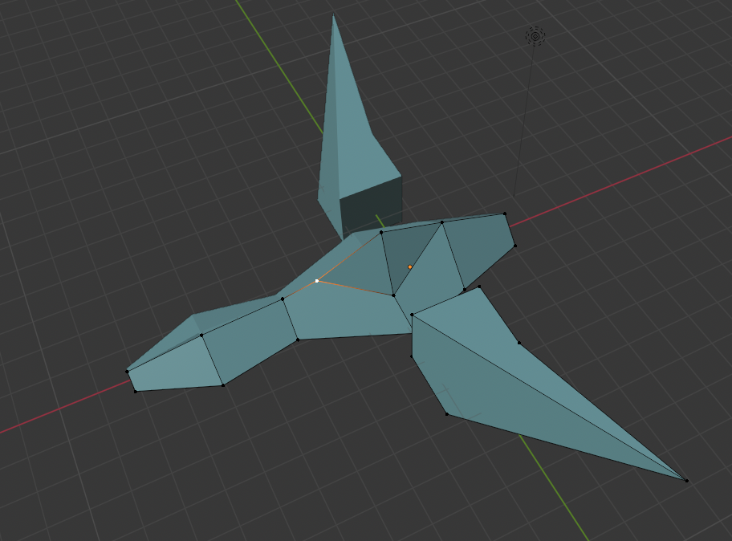
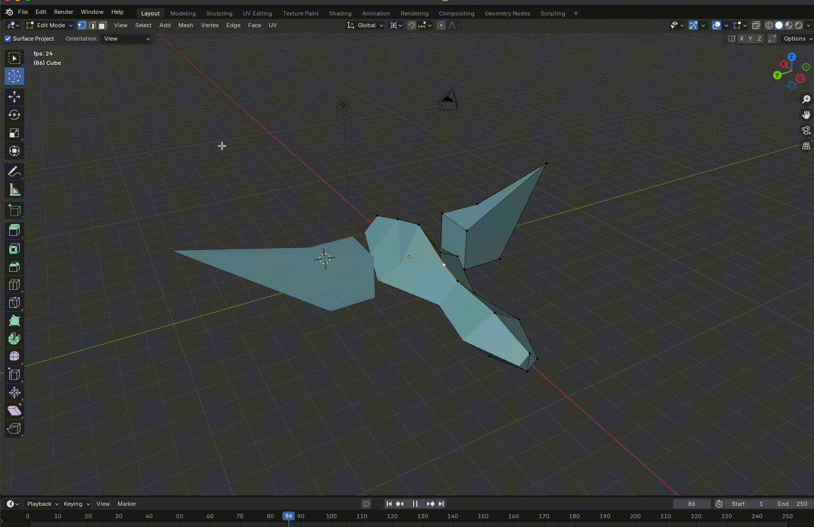

# Proyecto: Nave Espacial en Blender

Este proyecto consiste en la creación de un modelo 3D de una nave espacial sencilla utilizando el software Blender. El objetivo de esta tarea fue practicar el uso de herramientas básicas de modelado en Blender y configurar un pipeline para el proceso de renderizado.

## Descripción del Proyecto

La nave espacial fue modelada desde un cubo inicial en Blender, empleando las herramientas especificadas en las instrucciones:

- **Herramientas Utilizadas:**
  - Move
  - Scale
  - Rotate
  - Extrude
  - Inset
  - Bevel
  - Knife y Subdivide

  **Modifiers:** Se utilizaron algunos modifiers básicos para simplificar el modelado, manteniendo el diseño general lo más sencillo posible. Además, se aplicó un material con un color base simple, sin texturas complejas, de acuerdo con las indicaciones.

## Formato de Entrega

Para cumplir con los requisitos de entrega, se realizaron los siguientes pasos:

1. **Archivo .blend:** El modelo fue creado en Blender y se guardó como un archivo `.blend` para conservar el formato nativo y la información completa del proyecto.
   
2. **Exportación a .obj:** El modelo fue exportado al formato `.obj`, que es compatible con múltiples aplicaciones de modelado y renderizado 3D.

3. **Renderizado:** Se utilizó el renderizador interno de Blender para obtener imágenes de referencia del modelo, las cuales se incluyen en este repositorio.

4. **Capturas de Pantalla y GIF:** Se tomó una captura de pantalla del modelo en Blender, y se generó un GIF mostrando el modelo desde diferentes ángulos para facilitar su visualización en el README y en el servidor de Discord.

## Instrucciones de Uso

Para visualizar o modificar el modelo:

1. **Abrir el archivo .blend:** Puedes abrir el archivo `.blend` en Blender para ver o editar el modelo directamente. Asegúrate de tener instalada la versión 2.8 o superior de Blender.

2. **Importar el archivo .obj:** Si prefieres utilizar otro software 3D, el archivo `.obj` puede ser importado en la mayoría de aplicaciones de modelado.

3. **Renderizado:** Si deseas realizar un renderizado del modelo, puedes hacerlo directamente en Blender. Asegúrate de revisar la configuración de renderizado en el archivo `.blend` para obtener resultados similares a los de las imágenes proporcionadas.

## Captura de Pantalla del Modelo

## GIF del Modelo en 3D

A continuación se muestra un GIF del modelo desde diferentes ángulos para visualizarlo en 3D:

## Notas Adicionales

- **Triangulación:** Se verificó que el archivo esté correctamente triangulado antes de la exportación para asegurar compatibilidad y precisión en otros programas de modelado.
- **Compatibilidad:** El archivo `.obj` fue probado para garantizar su compatibilidad con diferentes aplicaciones de modelado y renderizado 3D.
